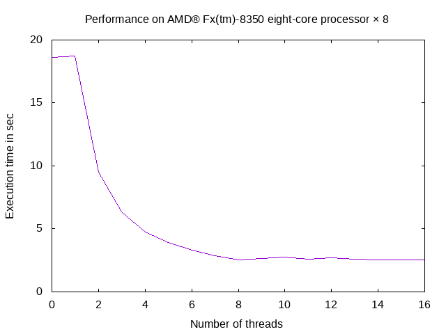
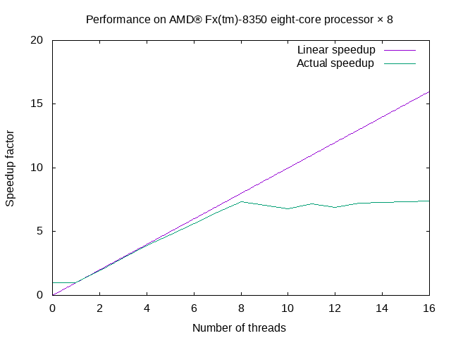

# ICE4131 - High Performance Computing (HPC)
## Lab 3: Parallelisation using Pthread
### Tutor: Franck Vidal

## Objectives

In this lab, you'll practice what we've seen in the lecture so far:

1.  Parallelise some serial code using Pthreads,
2.  Add timestamps to assess the execution time,
3.  Run the code on the compute nodes
4.  Plot graphs of runtimes and of speedups.

Some code is provided for your convenience. It is available on GitHub at [https://github.com/effepivi/SimpleRayTracing](https://github.com/effepivi/SimpleRayTracing).
- There is the serial code of a simple ray tracer in `src/main.cxx`.
- You'll add your code in `main-pthreads.cxx`.

<!-- Link to create images of code: https://carbon.now.sh -->


## Getting the code

1. Log on `hawklogin.cf.ac.uk` using your favourite SSH client, e.g. [putty](https://www.chiark.greenend.org.uk/~sgtatham/putty) on MS Windows.
2. If you haven't done it yet, download the code from GitHub using
```bash
$ git clone https://github.com/effepivi/SimpleRayTracing.git
$
```
3. If you already downloaded the code from GitHub
  - Go into the directory containing the files of this repository.
  - In case I changed the code, update the files using:
  ```bash
  $ git pull
  $
  ```

## Compiling environment

1. Create a script to set your environment, e.g. `env.sh`. It should contain:
```bash
module load cmake
module load gnuplot
module load compiler/intel/2020/2
```
2. Set your environment using:
```bash
$ source env.sh
$
```
**You'll need to run this command EVERY TIME you log in.**

3. You can use

```bash
$ module list
```
to check that the modules are loaded.

4. Create a `bin` directory using `mkdir`.

5. Go into `bin` using the `cd` command.

6. Configure your project using CMake:

```bash
$ cmake ..
$
```

7. Compile your code

```bash
$ make
$
```

## Notes

I made some changes to the program on the 28th of Nov:

- The rendering loop is now in a function (that'll be better for profiling).
- The program can use command line arguments:

```
Usage: ./main <option(s)>
Options:
	-h,--help                       Show this help message
	-s,--size IMG_WIDTH IMG_HEIGHT  Specify the image size in number of pixels (default values: 2048 2048)
	-b,--background R G B           Specify the background colour in RGB, acceptable values are between 0 and 255 (inclusive) (default values: 128 128 128)
	-j,--jpeg FILENAME              Name of the JPEG file (default value: test.jpg)
```

**Question:** Why?

**Answer:** When you edit your program and submit a job, you can run small tasks (nicer for debugging).


## Run your program

1. To run your program, launch a job. DO NOT RUN IT DIRECTLY ON `hawklogin.cf.ac.uk`. Be nice to other users!
2. See Lab 2.
3. Download the polygon mesh from Blackboard: `dragon.ply`
4. Download the texture file from Blackboard: `Bangor_Logo_A1.jpg`
5. Copy the files from your PC to `hawklogin.cf.ac.uk` using your favourite SCP client, e.g. [WinSCP](https://winscp.net/) or [FileZilla](https://filezilla-project.org/). Make sure you put the files in the same directory as `CMakeLists.txt`.
6. Create a new file named `submit-serial.sh` containing:
```bash
#!/usr/bin/env bash
#

#SBATCH --job-name=my_test # Job name
#SBATCH --nodes=1                    # Use one node
#SBATCH --mem=600mb                  # Total memory limit
#SBATCH --time=01:00:00              # Time limit hrs:min:sec

./main --jpeg test.jpg -b 128 0 0 -s 512 256
```
7. To launch it, use:
```bash
$ sbatch  --account=scw1563 submit-serial.sh
```
8. Wait for the job to complete. Use `squeue -u $USER`.
9. When the job is terminated, three new files should be there:
    - `test.jpg`,
    - `slurm-%j.out`, with %j the job number, and
    - `slurm-%j.err`, with %j the job number.
10. Use `more slurm-%j.out` to see the content of the file.
11. To see the new image, download `test.jpg` from `hawklogin.cf.ac.uk` to your PC using your favourite SCP client.
12. Use an image viewer to visualise the image.


## Add timestamps

1. Edit the file `../src/main.cxx` to add timestamps. You can use `nano`, `vi` or `emacs`.
2. See examples in [chapter4-2.cxx](../Lecture-4/chapter4-2.cxx).
3. You want to display how long it takes to perform the main steps in the main function, with and without threads.
    - Identify all the main steps.
    - Add timestamps.
    - Print the durations in the terminal.
4. Compile
5. Submit your job.
6. Use `more` to visualise the content of the `slurm-%j.out` file corresponding to the job.
7. Identify which step took the longest.

## Profiling

1. Run `ccmake .` and change the `CMAKE_BUILD_TYPE` variable to `Debug`.
2. Press `t` to "toggle".
3. In the `CMAKE_CXX_FLAGS_DEBUG` variable, add the `-pg` option. It will enable the profiling.
4. Configure.
5. Generate.
6. Compile.
7. Submit your job. It will create a file called `gmon.out`.
8. Look at [https://sourceware.org/binutils/docs/gprof/](https://sourceware.org/binutils/docs/gprof/) for information about how to use the profiler.
9. Analyse the results using:

```bash
$ gprof ./main > serial-profiling.txt
$ less serial-profiling.txt
```

10. Identify which step took the longest.


## Enable Pthread in CMake

1. Edit `CMakeLists.txt` and at the end of the file add:

```cmake
set(CMAKE_THREAD_PREFER_PTHREAD TRUE)
find_package(Threads REQUIRED)
```

It looks for the `pthread` library.

2. Add the program:

```cmake
add_executable(main-pthreads src/main-pthreads.cxx)
TARGET_LINK_LIBRARIES (main-pthreads PUBLIC RayTracing ${ASSIMP_LIBRARY} Threads::Threads)
```

## Parallelise this step

1. You need to edit `main-pthreads.cxx`. I would copy the content of `main.cxx` into `main-pthreads.cxx`.
2. Work load allocation:
    - Define a structure to store data required by each thread. You can see an example at Lines 9-15 in [chapter4-3-2.cxx](../Lecture-4/chapter4-3-2.cxx). **In your case, the polygon meshes, the light, maybe some other parameters, and the output image have to be accessible from the thread.**
    - Compute the number of pixels processed by each thread. You can see an example at Lines 45-66 in [chapter4-3-2.cxx](../Lecture-4/chapter4-3-2.cxx) for an example.
3. Create *T* threads:
    - Use the `pthread_create` function.
    - See the slides from Chapter 4 for an explanation, and
    - See Lines 18, 71-78, & 117-121 in [chapter4-3-3.cxx](../Lecture-4/chapter4-3-3.cxx) for an example.
4. Wait for all the threads to complete before saving the output image into a file.
    - Use the `pthread_join` function.
    - See the slides from Chapter 4 for an explanation, and
    - See Lines 80-84 in [chapter4-3-4.cxx](../Lecture-4/chapter4-3-4.cxx) for an example.
5. Write the callback
    - The lines of code corresponding to the most computationally intensive task has to be ported to the callback function.
    - See Lines 15-16, 34-36, 51, 63-64, 91-96, & 127-142 in [chapter4-3-5.cxx](../Lecture-4/chapter4-3-5.cxx) for an example.
7. Create a new script to submit the parallel job, e.g. `submit-pthread.sh`:

```bash
#!/usr/bin/env bash
#

#SBATCH --job-name=my_test # Job name
#SBATCH --nodes=1                    # Use one node
#SBATCH --mem=600mb                  # Total memory limit
#SBATCH --time=01:00:00              # Time limit hrs:min:sec

./main-pthreads --jpeg test.jpg -b 128 0 0 -s 512 256 -t $SLURM_CPUS_PER_TASK
```
7. Submit your job:

```bash
$ sbatch  --account=scw1563 -c N submit-pthread.sh
```
**Note: replace N above with a number between 1 and 40.**

- Check that the output image is correct. Is it the same as the image generated with the serial code?
- See if you have any speedup when you increase the number of thread.

## Generate a spreadsheet

- Create your own spreadsheet in a `.csv` format. See [chap4-performance.csv](../Lecture-4/chap4-performance.csv) for an example.
- Run gnuplot to generate graphs showing the execution time depending on the number of threads, and the speedup depending on the number of threads. See [chap4-performance.plt](../Lecture-4/chap4-performance.plt) for an example. This example generates PNG files such as:




- For the ray tracing problem, I provide two scripts, one for the [serial code](https://github.com/effepivi/SimpleRayTracing/blob/master/submit-serial.sh), one for the [pthread code](https://github.com/effepivi/SimpleRayTracing/blob/master/submit-pthread.sh).
- Edit this line `##SBATCH --mail-user=YOUREMAILADDRESS@bangor.ac.uk  # Where to send mail` to use your own email address. Also remove one of the `#` characters.
- I also provided a new python script to plot the data [`plotTiming.py`](https://github.com/effepivi/SimpleRayTracing/blob/master/plotTiming.py)
