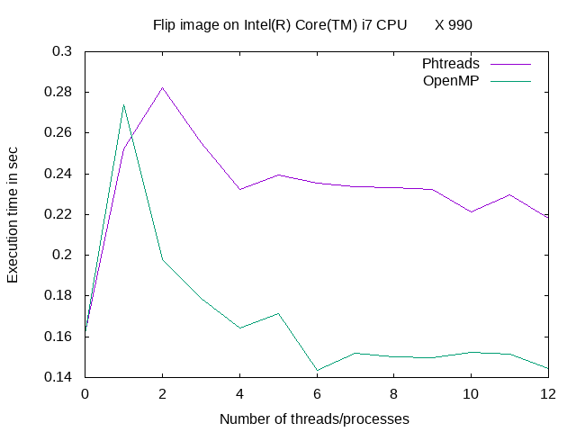
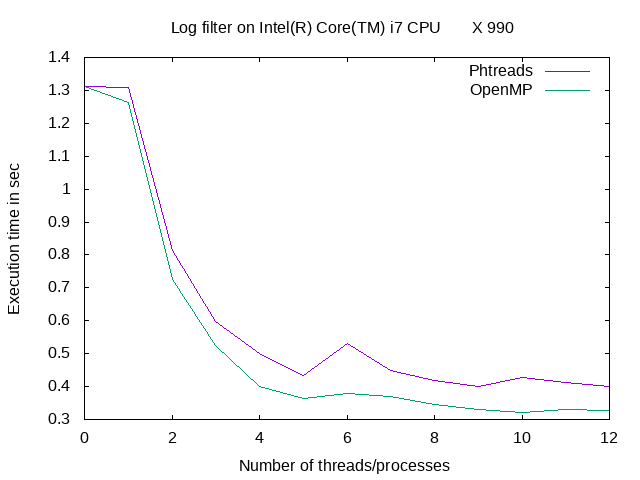
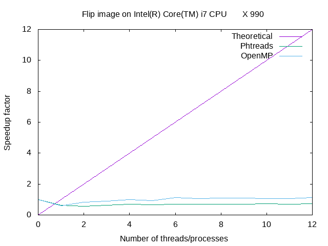
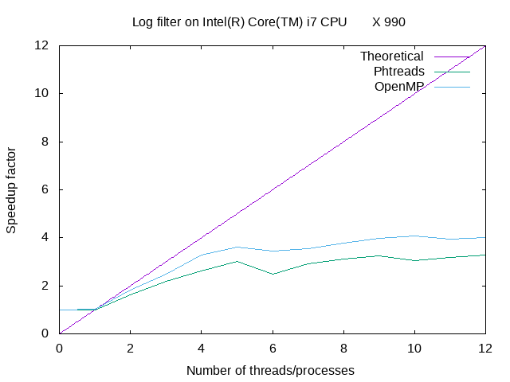
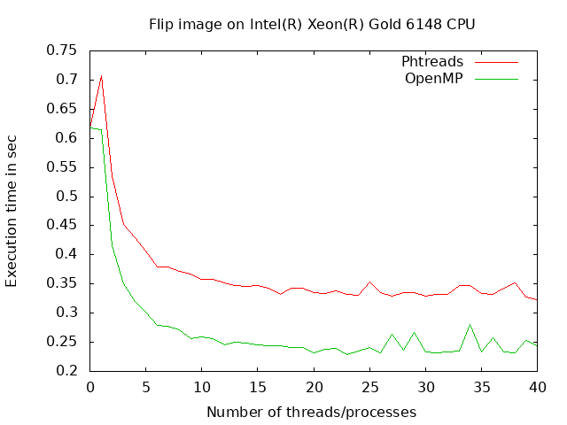
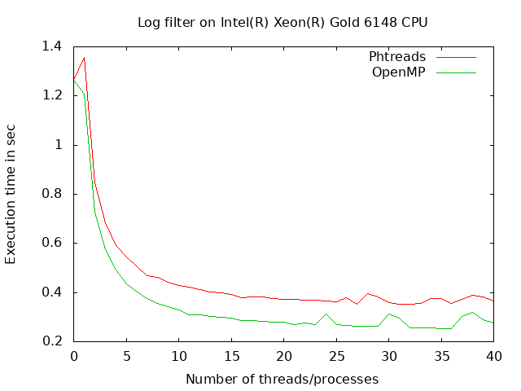
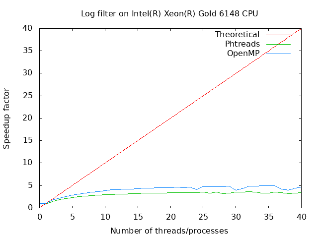

# ICE4131 - High Performance Computing (HPC)
## Lab 4: Pthreads versus OpenMP
### Tutor: Franck Vidal

## Objectives

In this lab, you practice what we've seen in the lecture so far:
1. Finish parallelising some serial code using Pthreads,
2. Add OpenMP pragmas to parallelise some serial code using OpenMP,
3. Compare the runtimes between Pthreads and OpenMP by plotting graphs of runtimes and of speedups.

Some code is provided for your convenience:
- `OpenMPImage` inherits of `Image`.
- `flip.cxx` and `log.cxx` are two programs making use of the serial code, phtread code, and OpenMP.
    - Usage: flip -- Flip the input image horizontally or vertically
```bash
        --horizontally
        -H
            Flip the image horizontally
        --vertically
        -V
            Flip the image vertically
        --num <n>
        -n <n>
            Number of threads/processes
        --implementation <string>
        -c <string>
            Choose implementation: serial|pthread|openmp|cuda|mpi
        --inputFile <fname>
        -i <fname>
            Input file to process
        --outputFile <fname>
        -o <fname>
            File to write
        --help
        -h
            Show help
```
    - Usage: log -- Apply a log filter on all the pixels of the input
```bash
        --num <n>
        -n <n>
            Number of threads/processes
        --implementation <string>
        -c <string>
            Choose implementation: serial|pthread|openmp|cuda|mpi
        --inputFile <fname>
        -i <fname>
            Input file to process
        --outputFile <fname>
        -o <fname>
            File to write
        --help
        -h
            Show help
```


<!-- Link to create images of code: https://carbon.now.sh -->


## Getting the code

1. Download the code from Blackboard. The file is `Lab4-20191030.tar.bz2`.
2. Copy this file from your PC to `hawklogin.cf.ac.uk` using WinSCP.
3. Connect to `hawklogin.cf.ac.uk` using a SSH client such as Putty.
4. Create a `LAB4` directory using `mkdir`.
5. Go into `LAB4` using the `cd` command.
6. Extract the archive using:
```bash
$ tar xjvfp ../Lab4-20191030.tar.bz2
```

## Loading the modules

1. Reuse `env.sh` from [Lab 3](../LAB3). It is used to load modules. You need the following modules:
- cmake
- gnuplot
- compiler/gnu/9/2.0

**You need to do this EVERY TIME you log in.**

If you can't remember where `env.sh` is, run the following command to locate where it is.
```bash
$ find ~ -name env.sh
```

To load the modules using the script, run
```bash
$ source PATH_TO_ENV/env.sh
```
(replace `PATH_TO_ENV` with the actual path, as provided by `find ~ -name env.sh`)


2. You can use
```bash
$ module list
```
to check that the modules are loaded.

3. Create a `bin` directory using `mkdir`.

4. Go into `bin` using the `cd` command.

5. Configure your project using CMake:
```bash
$ cmake ..
```

6. Compile your code
```bash
$ make
```


## Parallelise flipVertically() using Pthreads

You are expected to parallelise flipVertically() in `LAB3/src/PthreadImage.cxx`. See [Lab 3](../LAB3) for a tutorial.

**Make sure you compile your code regularly!**


## Parallelise logFilter() using Pthreads

You are expected to parallelise logFilter() in `LAB3/src/PthreadImage.cxx`. See [Lab 3](../LAB3) for a tutorial.


## Parallelise logFilter() using OpenMP

You have to parallelise logFilter() in `LAB4/src/OpenMPImage.cxx`.
A typical for loop looks like:
```cxx
    for (int i = 0; i < N; i++)
    {
        ...
    }
```

To parallelise it using OpenMP, a compiler instruction has to be specified using `#pragma`:
```cxx
#pragma omp parallel for
    for (int i = 0; i < N; i++)
    {
        ...
    }
```
In this case, the number of threads is automatically detected at runtime. It will corresponds to the number of CPU cores available on the system.

If you want to control the number of threads, add the `num_threads` clause:
```cxx
#pragma omp parallel for num_threads(N)
    for (int i = 0; i < N; i++)
    {
        ...
    }
```
with `N` the number of threads. This is what you have to use in this lab as you want to assess the behaviour of the program depending on the number of threads.


## Parallelise flipHorizontally() using OpenMP

The `flipHorizontally` method uses two nested loops:
```cxx
for (j = 0; j < m_height; j++)
{
    for (i = 0; i < m_width; i++)
    {
        DO SOMETHING
    }
}
```

The OpenMP collapse clause can be used to parallelise nested loops:
```cxx
#pragma omp parallel for collapse(2)
for (j = 0; j < m_height; j++)
{
    for (i = 0; i < m_width; i++)
    {
        DO SOMETHING
    }
}
```
In `collapse(2)`, `2` is used because we have two nested loops.

The OpenMP collapse clause will increase the number of iterations per thread. It will reduce the granularity of work to be done by each thread, which may improve performance.


## Parallelise flipVertically() using OpenMP

Same as for `flipHorizontally()`.


## Run your program

1. To run your program, launch a job. DO NOT RUN IT DIRECTLY ON `hawklogin.cf.ac.uk`. Be nice to other users!
2. See [Lab 2](../LAB2) for an explanation.
3. Create a new file named `submit1.sh` containing:
```bash
#!/usr/bin/env bash
#

#SBATCH --job-name=my_test # Job name
#SBATCH --nodes=1                    # Use one node
#SBATCH --mem=600mb                  # Total memory limit
#SBATCH --time=00:15:00              # Time limit hrs:min:sec


# Apply the log filter using serial implementation
./log \
    -i ../../LAB3/Airbus_Pleiades_50cm_8bit_grey_Yogyakarta.txt \
    -o log_image-serial.txt \
    -c serial

# Apply the log filter using OpenMP implementation
./log \
    -i ../../LAB3/Airbus_Pleiades_50cm_8bit_grey_Yogyakarta.txt \
    -o log_image-openmp.txt \
    -n $SLURM_CPUS_PER_TASK \
    -c openmp

# Apply the log filter using Pthread implementation
./log \
    -i ../../LAB3/Airbus_Pleiades_50cm_8bit_grey_Yogyakarta.txt \
    -o log_image-pthread.txt \
    -n $SLURM_CPUS_PER_TASK \
    -c pthread

# Flip the image using serial implementation
./flip \
    -H  \
    -i ../../LAB3/Airbus_Pleiades_50cm_8bit_grey_Yogyakarta.txt \
    -o flip_image-serial.txt \
    -c serial

# Flip the image using OpenMP implementation
./flip \
    -H  \
    -i ../../LAB3/Airbus_Pleiades_50cm_8bit_grey_Yogyakarta.txt \
    -o flip_image-openmp.txt \
    -n $SLURM_CPUS_PER_TASK \
    -c openmp

# Flip the image using Pthread implementation
./flip \
    -H  \
    -i ../../LAB3/Airbus_Pleiades_50cm_8bit_grey_Yogyakarta.txt \
    -o flip_image-pthread.txt \
    -n $SLURM_CPUS_PER_TASK \
    -c pthread
```

4. To launch it, use:
```bash
$ sbatch  --account=scw1563 -c N submit1.sh
```
**Note: replace `N` above with a number between 1 and 40.**
If `N` is high, your job may be waiting for resources. For testing purposes, try with `N < 10`.


5. Wait for the job to complete. Use `squeue -u $USER`.

6. When the job is terminated, five new files should be there:
    - `log_image-openmp.txt`,
    - `log_image-pthread.txt`,
    - `flip_image-openmp.txt`,
    - `flip_image-pthread.txt` and
    - `slurm-%j.out`, with %j the job number.

7. Use `more slurm-%j.out` to see the content of the file.

8. To see the new images, download them from `hawklogin.cf.ac.uk` to your PC using WinSCP.

9. Use ImageJ to visualise the image (Import->Text Image)

10. Only go to the next section when everything works as expected. If not, debug your code.

## Performance evaluation

A shell script - [run.sh](run.sh) - is provided for your own convenience. It will launch the programs iteratively using:
- serial implementation,
- Pthread implementation with the number of threads from 1 to 40,
- OpenMP implementation with the number of threads from 1 to 40.

It will also:
- Create CSV files to gather the execution time,
- Detect the CPU name,
- Create gnuplot scripts,
- Plot graphs with speedup factors, execution times for the log filter and the flip image programs:
    - log_execution_time.png
    - log_speedup.png
    - flip_execution_time.png
    - flip_speedup.png

Edit Line 4 of [run.sh](run.sh) if needed. It has to be the path to the input image.

The figures below show the execution time and speedup for `./flip` and `./log` when I run the `run.sh` script on my office PC (I only used 12 threads here).








**REMEMBER: DON'T RUN `run.sh` DIRECTLY ON HAWKLOGIN.CF.AC.UK!**

To execute the script, use SLURM. A script - [submit2.sh](submit2.sh) is provided:
```bash
#!/usr/bin/env bash
#
# Project/Account
#SBATCH -A scw1563
#
# We ask for 1 task with 40 cores.
# We need one node, just for us.
#
# Number of tasks per node
#SBATCH --ntasks-per-node=1
#
# Number of cores per task
#SBATCH --cpus-per-task=40
#
# Use one node
#SBATCH --nodes=1
#
# Runtime of this jobs is less then 12 hours.
#SBATCH --time=12:00:00

# Clear the environment from any previously loaded modules
module purge > /dev/null 2>&1

# Load the module environment suitable for the job
module load compiler/gnu/9/2.0 gnuplot

# And finally run the job​
./run.sh

# End of submit file
```
As we need 40 tasks (threads in our case), we want to have exclusive access to a compute node. This is what the following does:
```bash
# Number of tasks per node
#SBATCH --ntasks-per-node=1
#
# Number of cores per task
#SBATCH --cpus-per-task=40
#
# Use one node
#SBATCH --nodes=1
```

To submit your job, type:
```bash
$ sbatch submit2.sh
```
It is going to take a lot of time. When I tried it took about 15 minutes.
To check if your job is over, use
```bash
$ squeue -u $USER
```

Below is an example of output I obtained on SCW.





